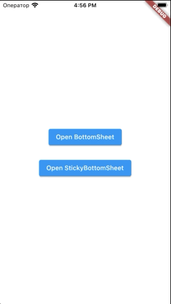

# Bottom Sheet

[](https://github.com/surfstudio/flutter-bottom-sheet)
[](https://codecov.io/gh/surfstudio/flutter-bottom-sheet)
[](https://pub.dev/packages/bottom_sheet)
[](https://pub.dev/packages/bottom_sheet)
[](https://pub.dev/packages/bottom_sheet/score)


This package is part of the [SurfGear](https://github.com/surfstudio/SurfGear) toolkit made by [Surf](https://surf.ru).

## About

Custom bottom sheet widget that can be resized in response to drag gestures and then scrolled.

## Usage

Main classes:

1. [FlexibleBottomSheet](lib/src/flexible_bottom_sheet.dart)
2. [BottomSheetRoute and showing methods](lib/src/flexible_bottom_sheet_route.dart)

Flexible and scrollable bottom sheet.

All you have to do is call `showFlexibleBottomSheet()` and you'll get a popup that looks like a modal bottom sheet and can be resized by dragging it up and down and scrolled when expanded.

There are 2 types of BottomSheets:  

1. BottomSheet
2. StickyBottomSheet

#### Simple BottomSheet


To show bottomSheet, use :

```dart
showFlexibleBottomSheet(
  minHeight: 0,
  initHeight: 0.5,
  maxHeight: 1,
  context: context,
  builder: _buildBottomSheet,
  anchors: [0, 0.5, 1],
);

Widget _buildBottomSheet(
    BuildContext context,
    ScrollController scrollController,
    double bottomSheetOffset,
  ) {
    return SafeArea(
      child: Material(
        child: Container(
          child: ListView(
            ...
          ),
        ),
      ),
    );
  }
```

#### Sticky BottomSheet



To show sticky BottomSheet, use:  
**You have to return SliverChildListDelegate from builder !!!**

```dart
showStickyFlexibleBottomSheet(
      minHeight: 0,
      initHeight: 0.5,
      maxHeight: 1,
      headerHeight: 200,
      context: context,
      backgroundColor: Colors.white,
      headerBuilder: (BuildContext context, double offset) {
        return Container(
          ...
        );
      },
      builder: (BuildContext context, double offset) {
        return SliverChildListDelegate(
          <Widget>[...],
        );
      },
      anchors: [0, 0.5, 1],
    );
```

## Installation

Add `bottom_sheet` to your `pubspec.yaml` file:

```yaml
dependencies:
  bottom_sheet: ^1.0.0
```

You can use both `stable` and `dev` versions of the package listed above in the badges bar.

## Changelog

All notable changes to this project will be documented in [this file](./CHANGELOG.md).

## Issues

To report your issues,  submit them directly in the [Issues](https://github.com/surfstudio/flutter-bottom-sheet/issues) section.

## Contribute

If you would like to contribute to the package (e.g. by improving the documentation, fixing a bug or adding a cool new feature), please read our [contribution guide](./CONTRIBUTING.md) first and send us your pull request.

Your PRs are always welcome.

## How to reach us

Please feel free to ask any questions about this package. Join our community chat on Telegram. We speak English and Russian.

[](https://t.me/SurfGear)

## License

[Apache License, Version 2.0](https://www.apache.org/licenses/LICENSE-2.0)
